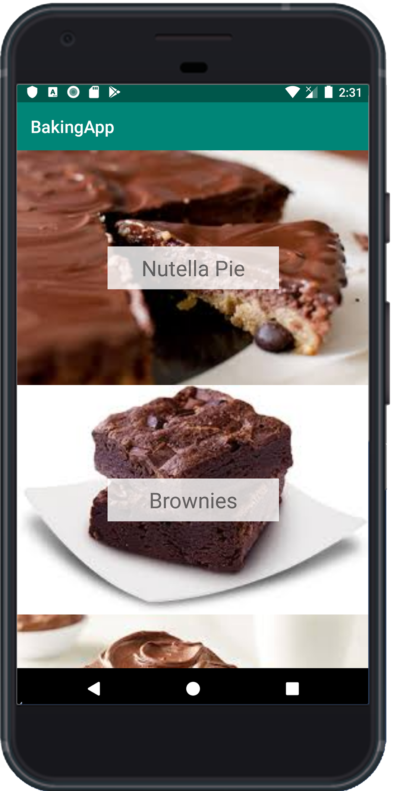
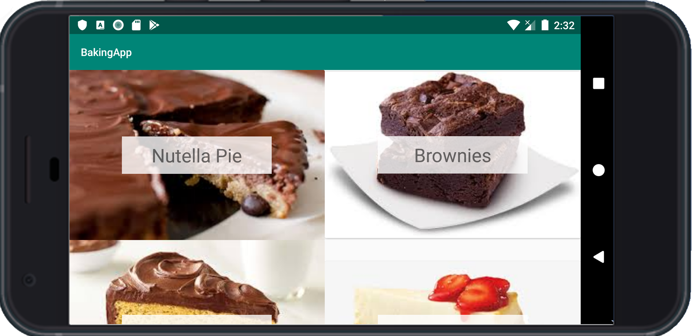
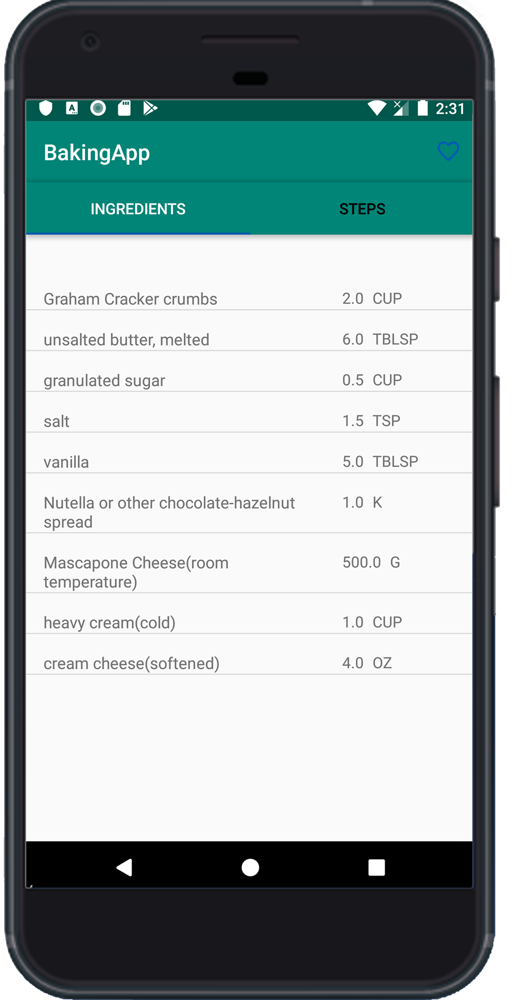
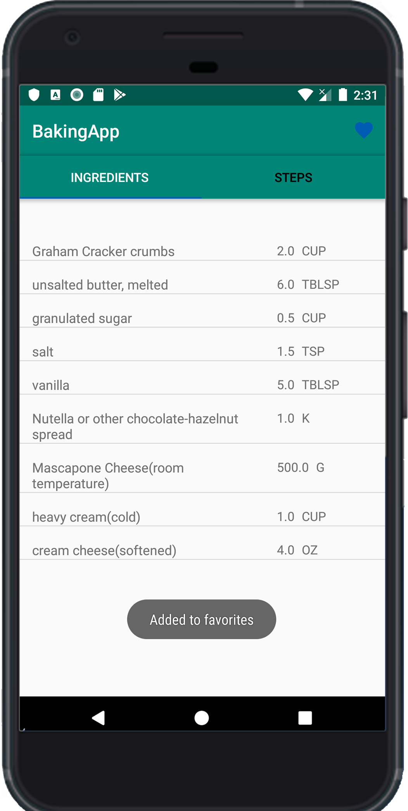

# BakingApp
This project is the third task of the Udacity's Android Nanodegree. 
This app Allows users to browse through different baking recipes, check their ingredients and walk through a step by step instructions. 
Also users are able to playback media, add and remove items to/from widget.

### What I Use
- MVP Pattern
- Retrofit2
- Picasso
- DataBinding
- Shared Preferences
- Widgets
- ExoPlayer
- Espresso

### User Interface
   

 

  

### License
<blockquote Copyright 2019 Yahia Salem

Licensed under the Apache License, Version 2.0 (the "License");
you may not use this file except in compliance with the License.
You may obtain a copy of the License at

    http://www.apache.org/licenses/LICENSE-2.0

Unless required by applicable law or agreed to in writing, software
distributed under the License is distributed on an "AS IS" BASIS,
WITHOUT WARRANTIES OR CONDITIONS OF ANY KIND, either express or implied.
See the License for the specific language governing permissions and
limitations under the License.
© 2019 GitHub, Inc.
</blockquote>
